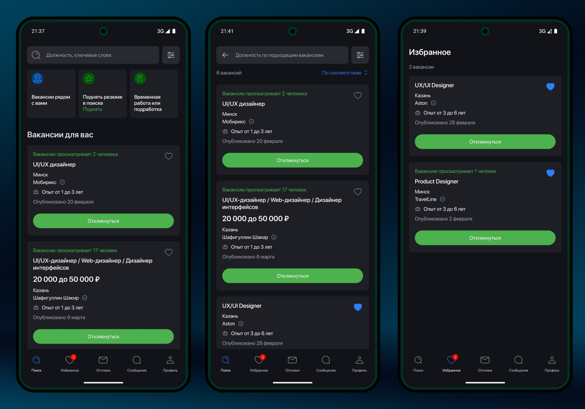

# О проекте

Android приложение, вдохновлённое популярным сервисом поиска работы hh.ru. Разработано в рамках выполнения тестового задания и реализует основные функции: просмотр вакансий, сохранение в избранное и рекомендации. Проект разработан с использованием последних технологий и архитектурных решений в Android-разработке.

## Скриншоты

## Технологии
- Kotlin
- Jetpack Compose
- Coroutines + Flow
- Clean Architecture с многомодульностью
- Dagger Hilt
- Retrofit
- Room
- Material Design 3

## Архитектура
Приложение построено по принципам многомодульности и Clean Architecture. Основной функционал разделён на feature-модули, которые используют общие компоненты из core-модулей.

Структура проекта включает:
- Основной модуль приложения для навигации
- Feature-модули для каждого основного экрана
- Core-модули с общей функциональностью, дизайн-системой и базовыми компонентами

## Прогресс разработки
✅ Реализовано:
- UI основных экранов (поиск, избранное)
- Навигация между экранами
- Базовая настройка темы и стилей
- Интеграция с API
- Локальное хранение данных
- Обработка ошибок

🚧 В процессе:
- Реализация репозиториев

